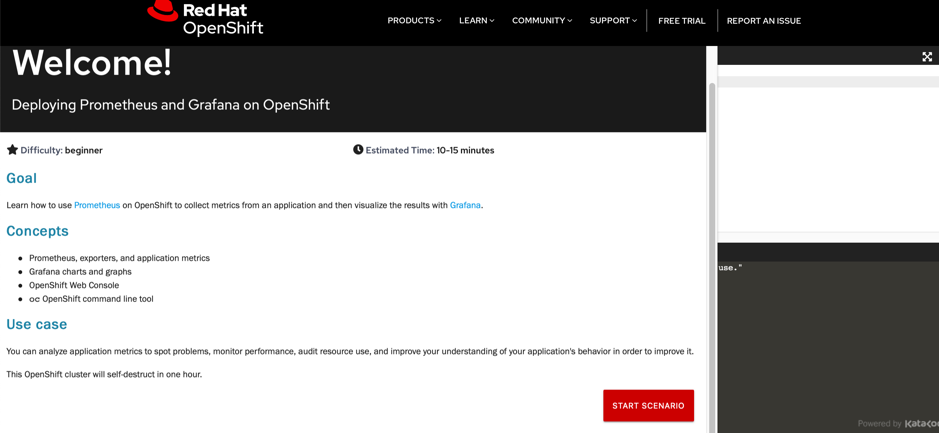

# Prometheus Cluster Monitoring

OpenShift Container Platform ships with a pre-configured and self-updating monitoring stack that is based on the Prometheus open source project and its wider eco-system.
It provides monitoring of cluster components and ships with a set of alerts to immediately notify the cluster administrator about any occurring problems and a set of Grafana dashboards.

### Steps to follow-

1) Click here https://learn.openshift.com/introduction/deploy-prometheus-grafana/
The user will be navigated to Interactive Learning Portal.

2) Click on the **Deploying Prometheus and Grafana on OpenShift** Start Scenario button.

3) Follow the steps from **Topic 1** to **Topic 4** .
