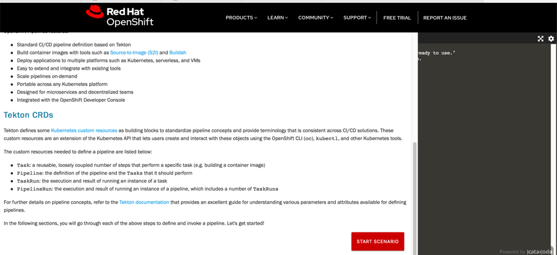

## OpenShift Pipelines

OpenShift Pipelines is a cloud-native, continuous integration and delivery (CI/CD) solution for building pipelines using Tekton. 
Tekton is a flexible, Kubernetes-native, open-source CI/CD framework that enables automating deployments across multiple platforms (e.g. Kubernetes, serverless, VMs, and so forth) by abstracting away the underlying details.

### Tekton CRDs

Tekton defines some Kubernetes custom resources as building blocks to standardize pipeline concepts and provide terminology that is consistent across CI/CD solutions. These custom resources are an extension of the Kubernetes API that lets users create and interact with these objects using the OpenShift CLI (oc), kubectl, and other Kubernetes tools.

The custom resources needed to define a pipeline are listed below:

Task: a reusable, loosely coupled number of steps that perform a specific task (e.g. building a container image)
Pipeline: the definition of the pipeline and the Tasks that it should perform
TaskRun: the execution and result of running an instance of a task
PipelineRun: the execution and result of running an instance of a pipeline, which includes a number of TaskRuns

### Topics covered in this session-
In this session you will learn how to use OpenShift Pipelines to automate the deployment of your applications.

1) Install the Pipelines Operator
2) Create a New Project
3) Create Sample Task
4) Task Resource Definitions
5) Create Pipeline
6) Trigger a Pipeline
7) Verify Deployment

### Steps to follow-

1) Click on https://learn.openshift.com/middleware/pipelines/

The user will be navigated to Interactive Learning Portal.

2) Click on the **Deploying Applications From Source** Start Scenario button.

3) Follow the steps from **Topic 1 - Install the Pipelines Operator** to **Topic 7 - Verify Deployment** .

### Takeaway

In this workshop, you have worked with OpenShift Pipelines and learned about underlying Tekton concepts. 
OpenShift Pipelines provides CI/CD solutions for addressing the fundamentals of CI/CD (i.e., automation of building, testing, and deploying application components) but also offers modern solutions around addressing scale, server maintenance, and making all parts of the CI/CD process highly reusable for any number of application development tasks.
