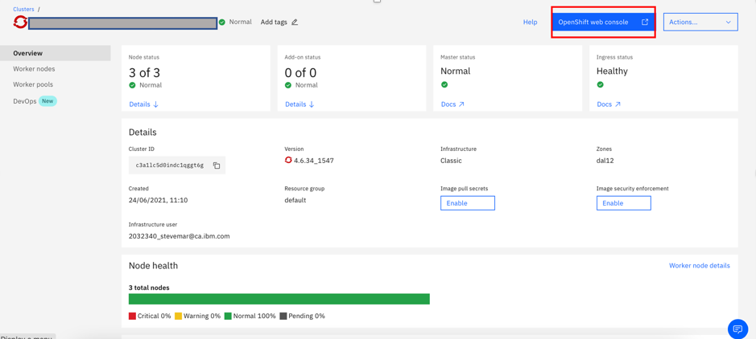
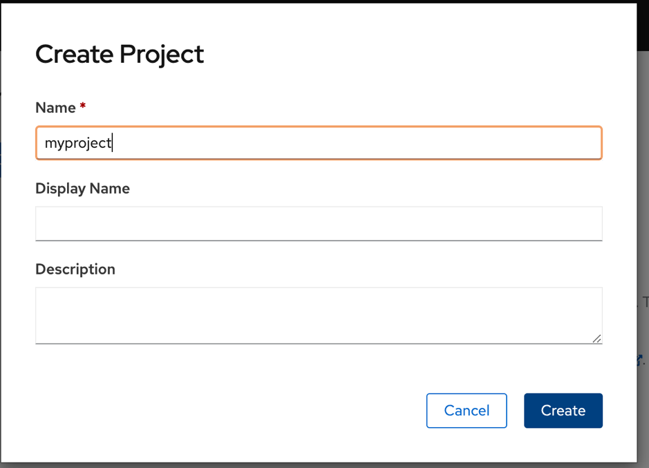
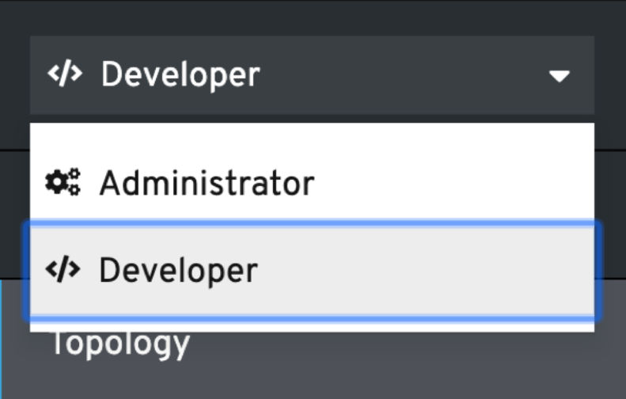
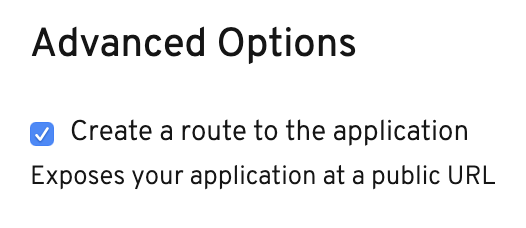
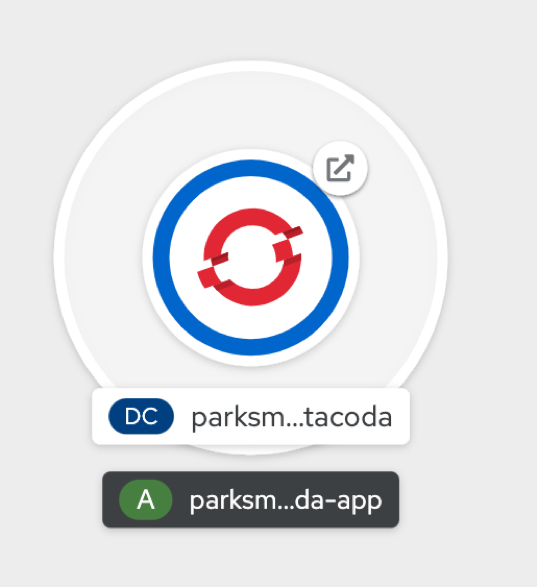
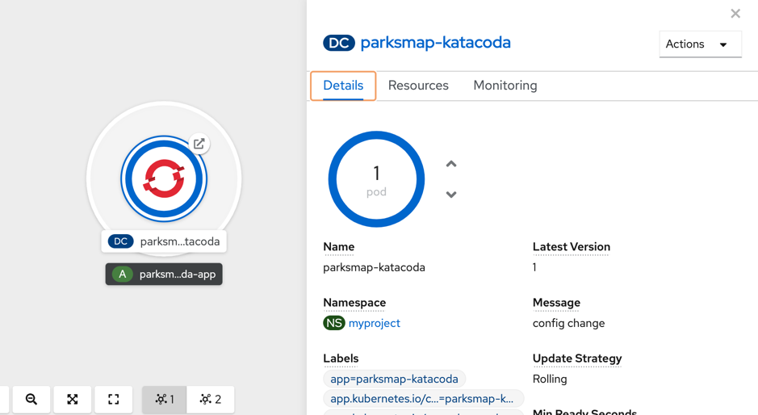
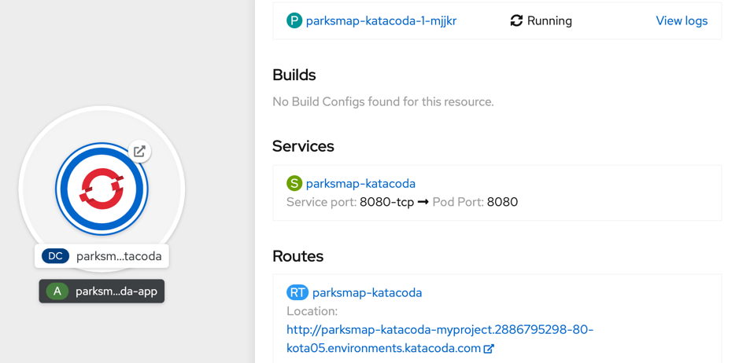
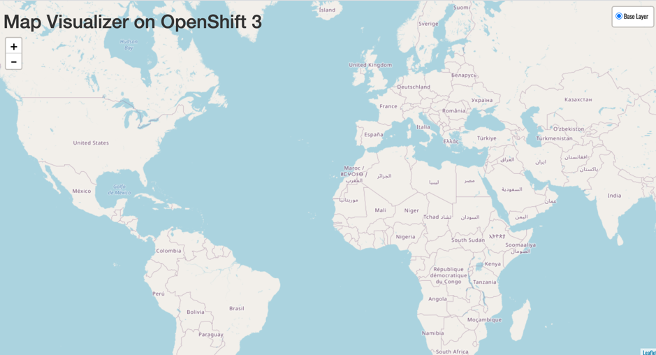

# Deploying a front end and backend application on OpenShift 

Learn how to deploy an application (the ParksMap front end) from a pre-existing container image.

## Steps

1. Logging into an evironment provided by your trainer, so that you can avail an OpenShift cluster.
2. Logging in with the Web Console
3. Creating a Project
4. Deploying Your First Image
5. Scaling Your Application
6. Routing HTTP Requests

## 1. Logging into an evironment provided by your trainer, so that you can avail an OpenShift cluster.

Check with your lab instructor to provide you a work environment.

## 2. Logging in with the Web Console

Access the OpeShift Web Console by clicking here.

This will open the web console on your browser.

## 3. Creating a Project

OpenShift is often referred to as a container application platform in that it is a platform designed for the development and deployment of applications in containers.

To group your application, we use **projects**. The reason for having a project to contain your application is to allow for controlled access and quotas for developers or teams.

More technically, it's a visualization of the Kubernetes namespace based on the developer access controls.

#### To create a project 

Click the blue Create Project button in the Administrator view -> Home -> Projects.

You should now see a page for creating your first project in the web console. 

Fill in the Name field as *myproject

 
The rest of the form is optional and up to you to fill in or ignore. 

Click *Create* to continue.

After your project is created, you will see some basic information about your project.

## 4.  Deploying Your First Image

Notice the navigation menu on the left. When you first log in, you'll typically be in the Administrator Perspective.

#### a) If you are not in the *Administrator* Perspective, click the perspective toggle and switch from Developer to Administrator.

 
**You are going to deploy the front end component of an application called parksmap. The web application will display an interactive map, which will be used to display the location of major national parks from all over the world.**

The simplest way to deploy an application in OpenShift is to take an existing container image and run it. 
The OpenShift web console provides various options to deploy an application to a project. For this section, we are going to use the Container Image method. As the project is empty at this point, the Topology view should display the following options: From Git, Container Image, From Catalog, From Dockerfile, YAML, and Database.

b) Choose the Container Image option.

c) Within the Deploy Image page, enter the following for Image name from external registry: *docker.io/openshiftroadshow/parksmap-katacoda:1.2.0*

Press tab or click outside of the text box to validate the image:

The Application Name field will be populated with **'parksmap-katacoda-app'** and the Name field with **'parksmap-katacoda'**. 

This name will be what is used for your application and the various components created that relate to it. 

Leave this as the generated value as steps given in the upcoming sections will use this name.

d) By default, creating a deployment using the Container Image method will also create a Route for your application.

**A Route makes your application available at a publicly accessible URL.**

Normally, you would keep this box checked, since it's very convenient to have the Route created for you. 

For the purposes of learning, *un-check the box*. We'll learn more about Routes later in the tutorial, and we'll create the Route ourselves then.

e) You are ready to deploy the existing container image. Click the blue Create button at the bottom of the screen. This should bring you back to the Topology view, where you'll see a visual representation of the application you just deployed. As the image deployment progresses, you'll see the ring around the 'parksmap-katacoda' deployment progress from white to light blue to blue.

These are the only steps you need to run to get a "vanilla" container image deployed on OpenShift. This should work with any container image that follows best practices, such as defining the port any service is exposed on, not needing to run specifically as the root user or other dedicated user, and which embeds a default command for running the application.

## 5. Scaling Your Application

Let's scale our application up to 2 instances of the pods. You can do this by clicking inside the circle for the parksmap-katacoda application from Topology view to open the side panel. In the side panel, click the Details tab, and then click the "up" arrow next to the Pod in side panel.

To verify that we changed the number of replicas, click the Resources tab in the side panel. 
Overall, that's how simple it is to scale an application (Pods in a Service).

## 6. Routing HTTP Requests

Services provide internal abstraction and load balancing within an OpenShift environment, but sometimes clients (users, systems, devices, etc.) outside of OpenShift need to access an application. The way that external clients are able to access applications running in OpenShift is through the OpenShift routing layer. The resource object which controls this is a Route.

The default OpenShift router (HAProxy) uses the HTTP header of the incoming request to determine where to proxy the connection. You can optionally define security, such as TLS, for the Route. If you want your Services, and, by extension, your Pods, to be accessible to the outside world, you need to create a Route.

As we mentioned earlier in the tutorial, the Container Image method of deploying an application will create a Route for you by default. Since we un-checked that option, we will manually create a Route now.

### Creating a Route
Fortunately, creating a Route is a pretty straight-forward process. First, go to the Administrator Perspective by switching to Administrator in the Developer drop down menu. Ensure that your myproject project is selected from the projects list. Next, click Networking and then Routes in the left navigation menu.

a) Click the blue Create Route button.

b) Enter **'parksmap-katacoda'** for the Route Name, select **'parksmap-katacoda'** for the Service, and 8080 for the Target Port. Leave all the other settings as-is.

c) Once you click Create, the Route will be created and displayed in the Route Details page.

d) You can also view your Route in the Developer Perspective. Toggle back to the Developer Perspective now, and go to Topology view. On the parksmap-katacoda visualization you should now see an icon in the top right corner of the circle. This represents the Route, and if you click it, it will open the URL in your browser.

e) Once you've clicked the Route icon, you should see this in your browser:

Congratulations! You just finished learning the basics of how to get started with the OpenShift Container Platform.

