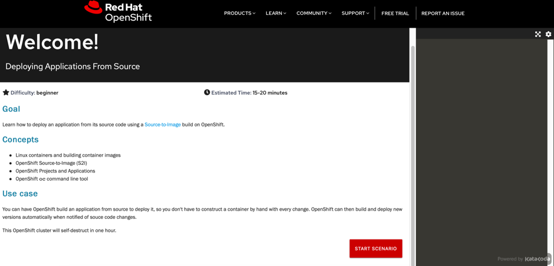

# Source to Image Deployments

## Overview

OpenShift allows developers to deploy applications without having to understand Docker and Kubernetes in depth. Similarily to the Cloud Foundry 'cf push' experience, developers can deploy applications easily via terminal commands and without having to build Docker images. In order to do this [Source-to-Image](https://github.com/openshift/source-to-image) is used.

Source-to-Image (S2I) is a toolkit for building reproducible container images from source code. S2I produces ready-to-run images by injecting source code into a container image.

In order to use S2I, builder images are needed. These builder images create the actual images with the applications. The builder images are similar to Cloud Foundry buildpacks.

## Getting started on Openshift Platform

1) Click on https://learn.openshift.com/introduction/deploying-python/

The user will be navigated to Interactive Learning Portal.

2) Click on the **Deploying Applications From Source** Start Scenario button.

3) Follow the steps from **Topic 1 - Creating an Initial Project** to **Topic 7 - Triggering a New Build** .

**Takeaway**

In this course you learned about deploying an application from source code using a Source-to-Image (S2I) builder. 
You first deployed the application from the web console, following that up with using the command line. 
You also learnt about using binary input source builds to run builds using source code from a local directory on your own computer.

The web application you deployed was implemented using the Python programming language.
OpenShift provides S2I builders for a number of different programming languages/frameworks in addition to Python. These include Java, NodeJS, Perl, PHP and Ruby.
